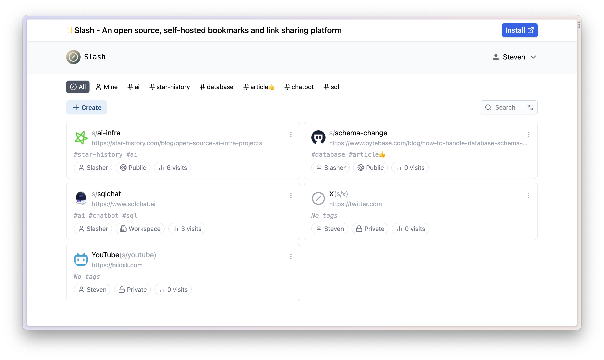
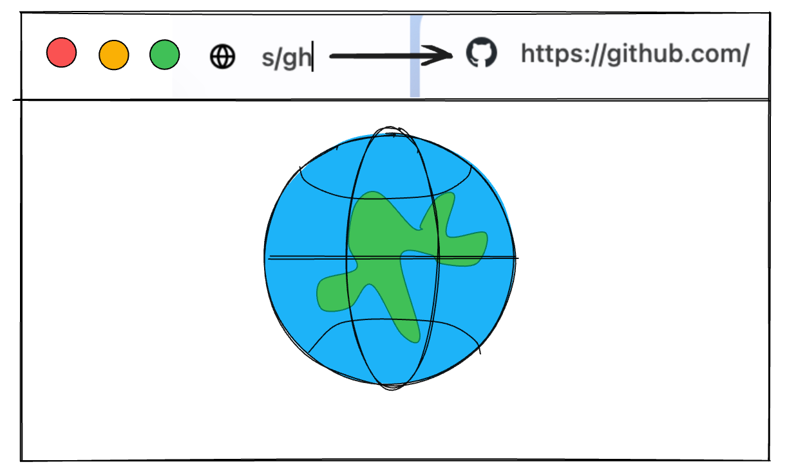

# Slash


**Slash** is an open source, self-hosted bookmarks and link sharing platform. It allows you to organize your links with tags, and share them using custom shortened URLs. Slash also supports team sharing of link libraries for easy collaboration.

🧩 Browser extension(v1.0.0) now available! - [Chrome Web Store](https://chrome.google.com/webstore/detail/slash/ebaiehmkammnacjadffpicipfckgeobg), [Firefox Add-on](https://addons.mozilla.org/firefox/addon/your-slash/)

<a href="https://demo.slash.yourselfhosted.com">Live Demo</a> • <a href="https://discord.gg/QZqUuUAhDV">Discord</a>

<p>
  <a href="https://hub.docker.com/r/yourselfhosted/slash"></a>
  <a href="https://github.com/boojack/slash/stargazers"></a>
</p>



## Features

- Create customizable `/s/` short links for any URL.
- Share short links public or only with your teammates.
- View analytics on link traffic and sources.
- Easy access to your shortcuts with browser extension.
- Open source self-hosted solution.

## Deploy with Docker in seconds

```bash
docker run -d --name slash -p 5231:5231 -v ~/.slash/:/var/opt/slash yourselfhosted/slash:latest
```

Learn more in [Self-hosting Slash with Docker](https://github.com/boojack/slash/blob/main/docs/install.md).

## Browser Extension

Slash provides a browser extension to help you use your shortcuts in the search bar to go to the corresponding URL.



Learn more in [The Browser Extension of Slash](https://github.com/boojack/slash/blob/main/docs/install-browser-extension.md).

### Chromium based browsers

For Chromium based browsers(Chrome, Edge, Arc, ...), you can install the extension from the [Chrome Web Store](https://chrome.google.com/webstore/detail/slash/ebaiehmkammnacjadffpicipfckgeobg).

### Firefox

For Firefox, you can install the extension from the [Firefox Add-ons](https://addons.mozilla.org/firefox/addon/your-slash/).
