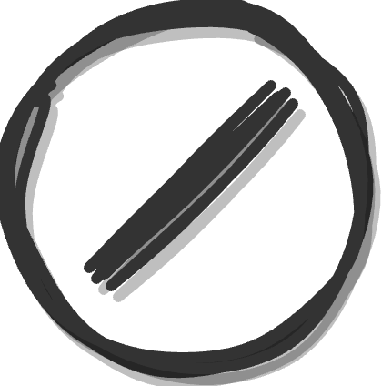
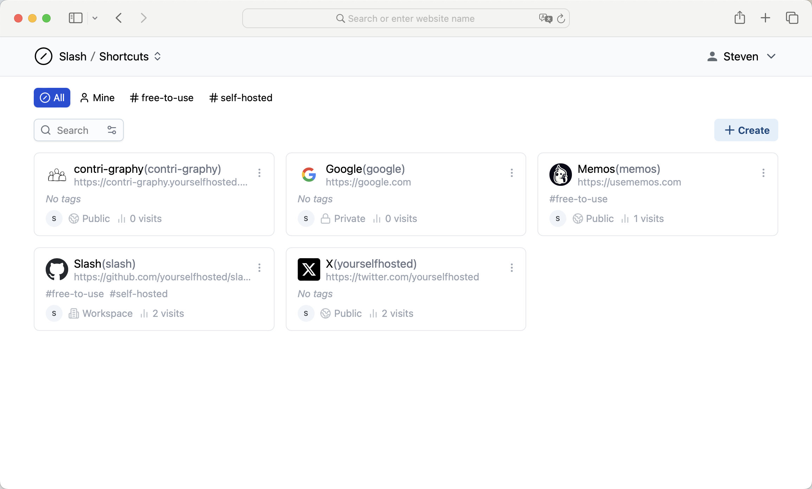
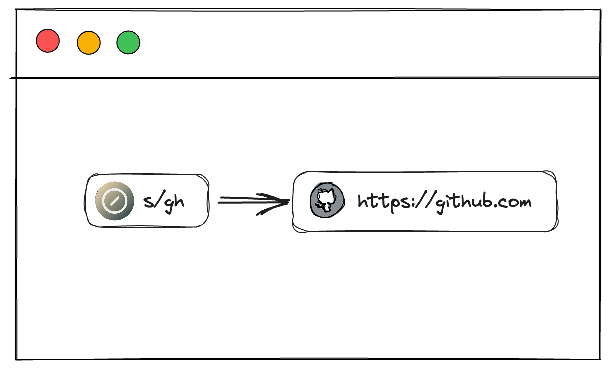

# Slash



**Slash** is an open source, self-hosted bookmarks and link sharing platform. It allows you to organize your links with tags, and share them with custom shortened URLs. Slash also supports team sharing of link libraries for easy collaboration.

🧩 Browser extension(v1.0.0) now available! - [Chrome Web Store](https://chrome.google.com/webstore/detail/slash/ebaiehmkammnacjadffpicipfckgeobg), [Firefox Add-on](https://addons.mozilla.org/firefox/addon/your-slash/)

Getting started with Slash's [Shortcuts](https://github.com/boojack/slash/blob/main/docs/getting-started/shortcuts.md) and [Collections](https://github.com/boojack/slash/blob/main/docs/getting-started/collections.md).

<a href="https://demo.slash.yourselfhosted.com">Live Demo</a> • <a href="https://discord.gg/QZqUuUAhDV">Discord</a>

<p>
  <a href="https://hub.docker.com/r/yourselfhosted/slash"></a>
  <a href="https://github.com/boojack/slash/stargazers"></a>
</p>



## Background

In today's workplace, essential information is often scattered across the cloud in the form of links. We understand the frustration of endlessly searching through emails, messages, and websites just to find the right link. Links are notorious for being unwieldy, complex, and easily lost in the shuffle. Remembering and sharing them can be a challenge.

That's why we developed Slash, a solution that transforms these links into easily accessible, discoverable, and shareable shortcuts(e.g., `s/shortcut`). Say goodbye to link chaos and welcome the organizational ease of Slash into your daily online workflow.

## Features

- Create customizable `s/` short links for any URL.
- Share short links public or only with your teammates.
- View analytics on link traffic and sources.
- Easy access to your shortcuts with browser extension.
- Share your shortcuts with Collection to anyone, on any browser.
- Open source self-hosted solution.

## Deploy with Docker in seconds

```bash
docker run -d --name slash -p 5231:5231 -v ~/.slash/:/var/opt/slash yourselfhosted/slash:latest
```

Learn more in [Self-hosting Slash with Docker](https://github.com/boojack/slash/blob/main/docs/install.md).

## Browser Extension

Slash provides a browser extension to help you use your shortcuts in the search bar to go to the corresponding URL.



Learn more in [The Browser Extension of Slash](https://github.com/boojack/slash/blob/main/docs/install-browser-extension.md).

### Chromium based browsers

For Chromium based browsers(Chrome, Edge, Arc, ...), you can install the extension from the [Chrome Web Store](https://chrome.google.com/webstore/detail/slash/ebaiehmkammnacjadffpicipfckgeobg).

### Firefox

For Firefox, you can install the extension from the [Firefox Add-ons](https://addons.mozilla.org/firefox/addon/your-slash/).
