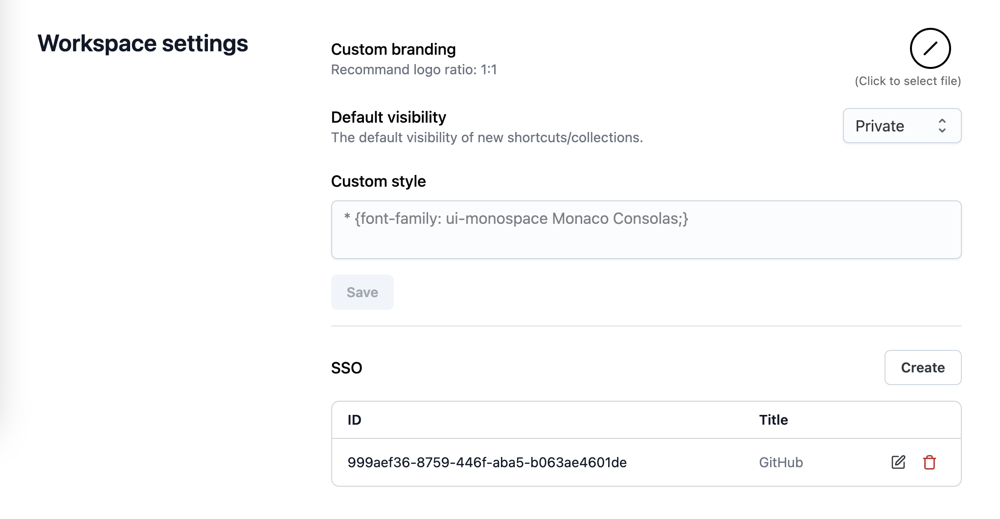
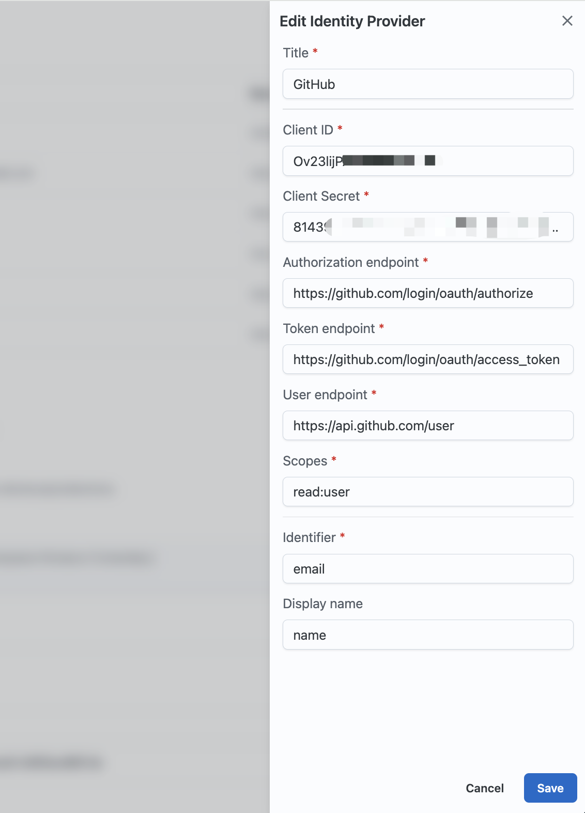

# Single Sign-On(SSO)

> **Note**: This feature is only available in the **Enterprise** plan.

**Single Sign-On (SSO)** is an authentication method that enables users to securely authenticate with multiple applications and websites by using just one set of credentials.

Slash supports SSO integration with **OAuth 2.0** standard.

## Create a new SSO provider

As an Admin user, you can create a new SSO provider in Setting > Workspace settings > SSO.

For example, to integrate with GitHub, you might need to fill in the following fields:

