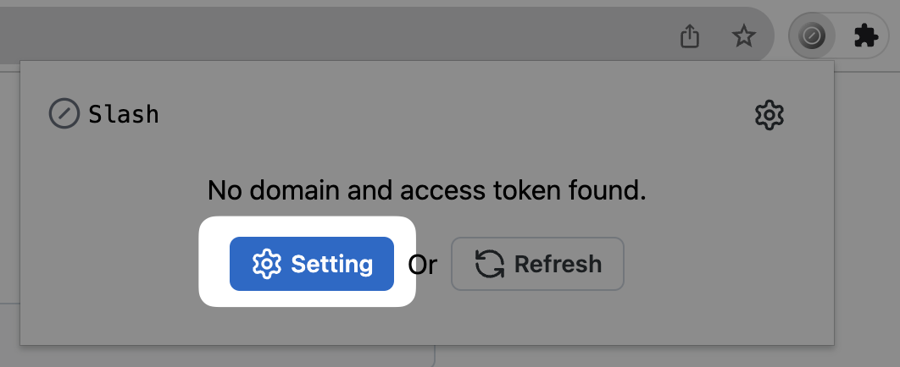
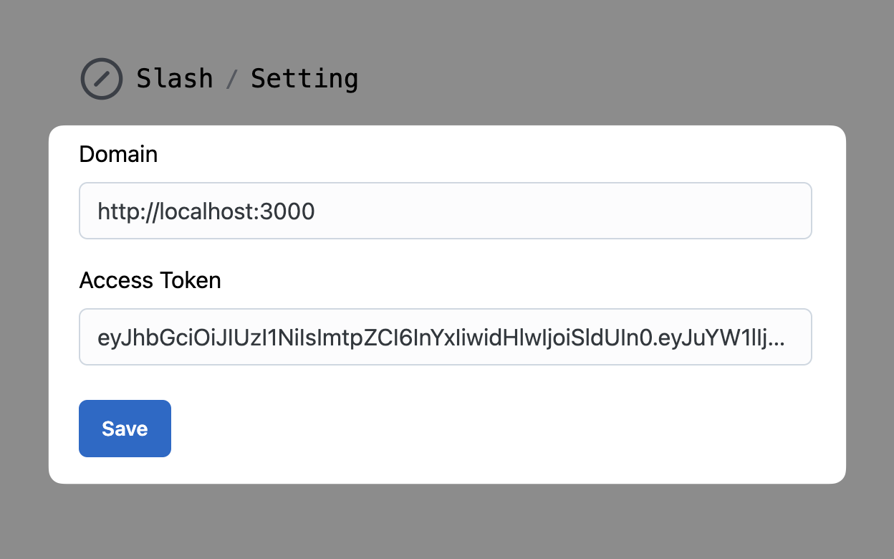
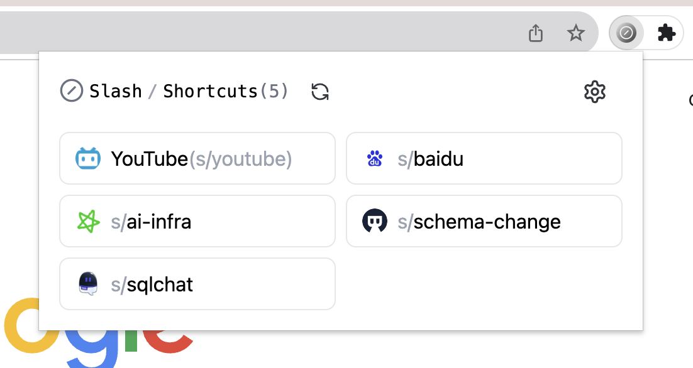
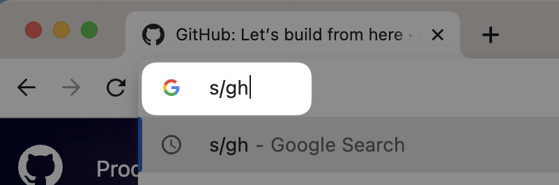

# The Browser Extension of Slash

Slash provides a browser extension to help you use your shortcuts in the search bar to go to the corresponding URL.

## How to use

### Generate an access token

1. Go to your Slash instance and sign in with your account.

2. Go to the settings page and click on the "Create" button to create an access token.

   

3. Copy the access token and save it somewhere safe.

   

### Install the extension

> **Note**: The extension is not published to the Chrome Web Store yet. You can install it from the source code.

For Chromuim based browsers, you can download the packed extension from the [resources](https://github.com/boojack/slash/tree/main/extension/resources).

For Firefox, we don't support the Firefox Add-ons platform yet. And we are working on it.

### Configure the extension

1. Click on the extension icon and click on the "Settings" button.

   

2. Enter your Slash's domain and paste the access token you generated in the previous step.

   

3. Click on the "Save" button to save the settings.

4. Click on the extension icon again, you will see a list of your shortcuts.

   

### Use your shortcuts in the search bar

You can use your shortcuts in the search bar of your browser. For example, if you have a shortcut named `gh` for [GitHub](https://github.com), you can type `s/gh` in the search bar and press `Enter` to go to [GitHub](https://github.com).

